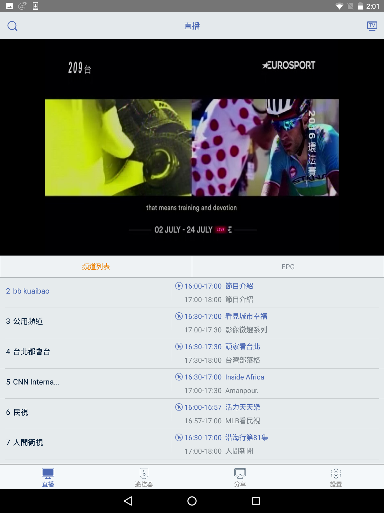
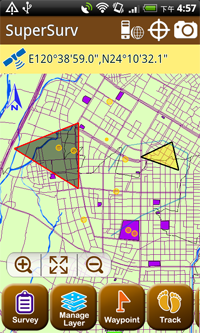
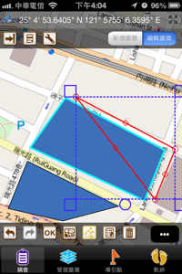

## STB YouLook APP
STB YouLook Mobile Application for Android of CNS in Taiwan during the period from June 2016 to February 2017.
The app can control STB, share mobile media data watch video of STB Channel.

The Technical skills include 
1. react-native framework and MVP architecture
2. Media player (VLC player and media format includes MPEG-TS, HLS)
3. Media Share (DLNA using Cling)
4. IM (XMPP using smack)
5. communicate with STB (SOAP protocol in JNI layer)

#### Broser on Main Page

#### Play STB Video

#### Share mobile Photo

## SuperSurv
SuperSurv, mobile survey system, integrating GIS and GPS technologies is a mobile GIS system for surveying field data, which works on mobile devices with Android OS. The main functions include data collection, orientation, map display and waypoint guidance.

#### Map

#### measure

